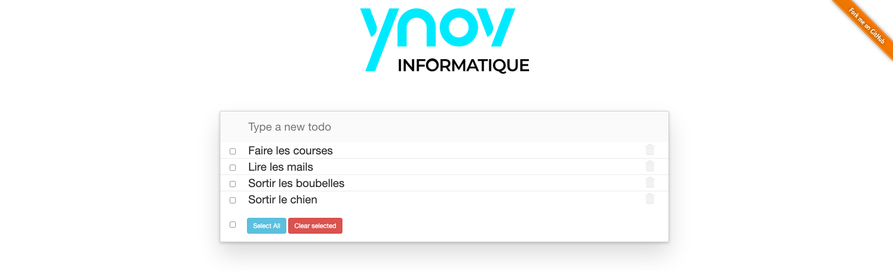
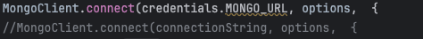
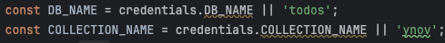
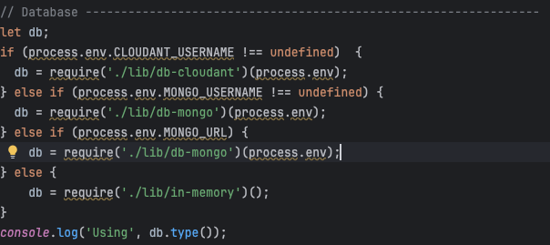
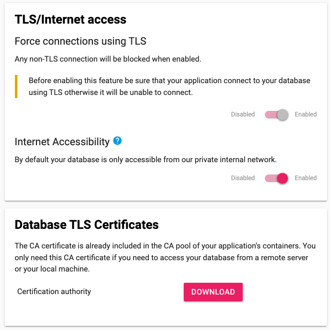
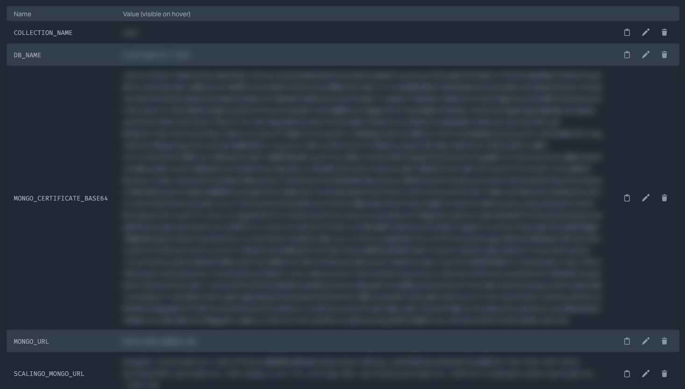
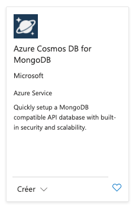
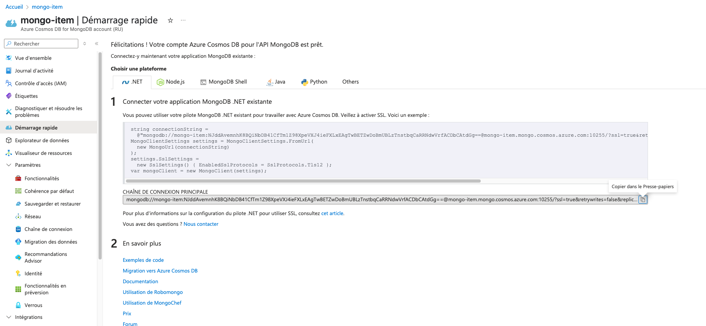

# Todo
URL du site: https://ynovtodolist.osc-fr1.scalingo.io/



## Modification de db-mongo.js
J'ai remplacer la connexion par username mot de passe par l'url



J'ai mis le bon nom de ma base de donnée 



## Modification de server.js



## Modification BDD Scalingo
Activation du TLS et Block non-TLS connections
Download Certificate



## Ajout des variable d'env sur Scalingo



Pour récupérer le certificat je l'ai téléchargé puis ai utilisé:

``` sh
base64 -i ca.pem
```

## Ajout des variable d'env sur Scalingo
On créer dans un groupe de ressource une base de donée Cosmos



et on vas modifier les var d'env de Scalingo on créer une variable AZUR_MONGO_URL
On modifie MONGO_URL qui prendra maintenant $AZUR_MONGO_URL

Dans AZUR_MONGO_URL on récupère l'url direct sur Azur

